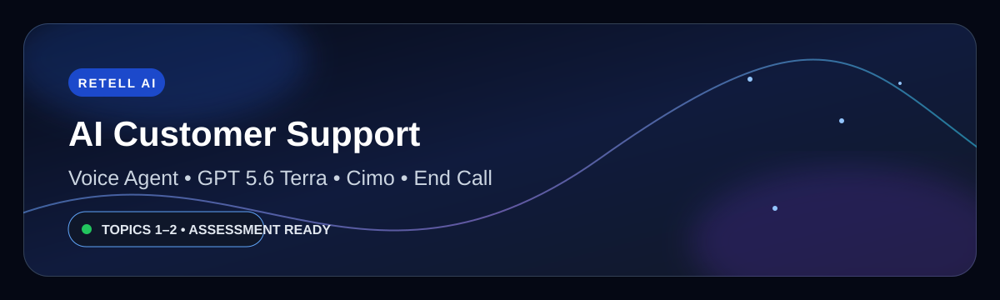

<div align="center">



# 🤖 Retell AI Customer Support Voice Agent

**Production-style voice AI assessment project built with Retell AI**

[](https://www.retellai.com/)
[](#-agent-configuration)
[](#-agent-configuration)
[](#-agent-configuration)
[](#-validation-results)

[▶ WATCH TOPIC 2 LOOM](https://www.loom.com/share/eb100ab9828e434caaf9f49ea660cf3) · [📄 TOPIC 2 PDF](./Retell_AI_Topic_2_Assessment_Documentation.pdf) · [📂 EVIDENCE](#-screenshots--evidence)

</div>

---

## 🎯 Project Overview

This repository documents a **Retell AI customer-support voice agent** developed across Topic 1 and Topic 2 of the assessment workflow.

Topic 2 focuses on production-style prompt engineering and voice behavior: structured system instructions, concise responses, competitor-pricing refusal, hallucination prevention, ordered feedback collection, interruption handling, custom vocabulary, and transcript validation.

> **Assessment focus:** Retell AI — Configuring Agent Prompts & System Instructions

---

## ✨ What This Agent Demonstrates

| Capability | Implementation |
|---|---|
| 🗣️ Voice Conversation | Natural customer-support conversation using Retell AI |
| 🧠 Structured Prompt | Role, call flow, constraints, safety, survey, closing |
| 📏 Response Control | Maximum two sentences per response |
| 🛡️ Hallucination Prevention | Refuses unsupported future/product information |
| 💰 Competitor Pricing | Politely declines competitor pricing requests |
| 📝 Feedback Survey | Rating → likes/dislikes → improvement suggestion |
| 🎧 Interruption Handling | Configured with 0.9 interruption sensitivity |
| 🔤 Custom Vocabulary | Retell AI, GPT 5.6 Terra, Cimo, Voice Agent, etc. |
| 📞 Call Completion | Built-in End Call function |
| 🔎 Validation | Transcript + Call History performance review |

---

## ⚙️ Agent Configuration

| Setting | Value |
|---|---|
| **Workspace** | `my-project` |
| **Agent Name** | `AI Customer Support Agent` |
| **Agent Type** | Single-Prompt Agent |
| **Model** | GPT 5.6 Terra |
| **Voice** | Cimo |
| **Language** | English (US) |
| **Welcome Message** | AI speaks first |
| **Interruption Sensitivity** | `0.9` |
| **Background Sound** | None |
| **Response Wait Time** | `0 ms` |
| **Functions** | Built-in `end_call` only |
| **Transcript Retention** | Everything |

### 👋 Welcome Message

> Hello! Welcome to our customer support service. I'm your AI assistant. How can I help you today?

---

## 🧠 Structured System Prompt

The Topic 2 prompt is organized into explicit behavioral sections:

1. **Role** — defines the customer-support assistant behavior.
2. **Call Flow Overview** — keeps conversations focused and consistent.
3. **Response Constraints** — concise, voice-first replies with no Markdown, lists, tables, or emojis.
4. **Accuracy & Hallucination Prevention** — do not invent unavailable product, policy, account, pricing, or future-launch information.
5. **Greeting** — fixed initial welcome message.
6. **Request Handling** — understand the caller and clarify only when necessary.
7. **Competitor Pricing Policy** — decline competitor pricing requests and redirect to available support information.
8. **Survey Workflow** — collect feedback in the required sequence.
9. **Interruption Handling** — stop/adjust naturally when the caller takes the turn.
10. **Closing & Hold Handling** — keep the voice interaction polite and controlled.

### 📋 Survey Sequence

**Q1:** Overall experience rating from 1 to 5  
**Q2:** What the customer liked or disliked  
**Q3:** Suggestions for improvement

The survey is handled one question at a time and in the required order.

---

## 🔤 Custom Vocabulary

The agent uses boosted keywords to improve recognition of project-specific terminology:

`Retell AI` · `GPT 5.6 Terra` · `Cimo` · `AI Customer Support` · `Voice Agent` · `Customer Support Assistant`

---

## 🧪 Validation Results

A live Retell Web Test Call was completed and reviewed in **Retell AI → Call History**.

| Validation Item | Result |
|---|---|
| Agent speaks first | ✅ Passed |
| Responses limited to ≤2 sentences | ✅ Passed |
| Competitor pricing refused | ✅ Passed |
| Unsupported future information refused | ✅ Passed |
| Feedback survey started correctly | ✅ Passed |
| Survey order Q1 → Q2 → Q3 | ✅ Passed |
| One survey question at a time | ✅ Passed |
| No Markdown / lists in replies | ✅ Passed |
| Closing behavior | ✅ Passed |
| Transcript available | ✅ Passed |
| Interruption sensitivity configured | ✅ `0.9` |

### 📊 Call Performance

| Metric | Value |
|---|---|
| **Duration** | 1m 56s |
| **Cost** | $0.282 |
| **Status** | Ended |
| **Call Result** | Successful |
| **User Sentiment** | Positive |
| **End-to-End Latency** | 1566 ms |
| **Disconnection** | Agent hangup |

> **Evidence note:** interruption handling was configured and verified at the Retell setting level. The recorded transcript does not contain a clear overlapping-speech interruption event, so this repository does not claim that the live call itself proved an overlap test.

---

## 📝 Validated Conversation Highlights

**Customer:** What services do you provide?  
**Agent:** I don't have details about specific services, but I can help answer customer support questions or collect feedback.

**Customer:** How much does your competitor charge for the same service?  
**Agent:** I can't provide competitor pricing, but I can help you with information about our own services.

**Customer:** What new product will your company launch next year?  
**Agent:** I don't have information about future product launches.

**Customer:** I would like to give feedback.  
**Agent:** How would you rate your overall experience from 1 to 5?

**Customer:** I would rate it four.  
**Agent:** What did you like or dislike about the experience?

**Customer:** I like the quick response.  
**Agent:** Do you have any suggestions for improvement?

**Customer:** You could improve the service speed.  
**Agent:** Thank you so much for your feedback, we really appreciate it. How can I help you?

---

## 🎥 Loom Demonstrations

### Topic 2 — Prompt & Voice Configuration + Validation

[▶ Open Topic 2 Loom Demo](https://www.loom.com/share/eb100ab9828e434caaf9f49ea660cf3)

### Topic 1 — Initial Retell AI Agent Setup

[▶ Open Topic 1 Loom Demo](https://www.loom.com/share/b4287c142d594016a94ff93b4bf0553f)

---

## 📄 Assessment Documentation

- [📘 Topic 2 Assessment Documentation (PDF)](./Retell_AI_Topic_2_Assessment_Documentation.pdf)
- [📘 Topic 1 Assessment Documentation (PDF)](./Retell_AI_Topic_1_Assessment_Documentation.pdf)
- [📘 Topic 2 Evidence Index](./docs/TOPIC_2_README.md)

The Topic 2 PDF includes configuration evidence, validation metrics, transcript review, checklist status, and the interruption-handling evidence note.

---

## 🖼️ Screenshots & Evidence

All uploaded screenshots are retained in the repository for LMS assessment evidence.

### Topic 1 / Initial Configuration

- [🖼️ Screenshot 1](./Screenshot%202026-09-29%20105854.png)
- [🖼️ Screenshot 2](./Screenshot%202026-09-29%20110003.png)
- [🖼️ Screenshot 3](./Screenshot%202026-09-29%20110050.png)
- [🖼️ Screenshot 4](./Screenshot%202026-09-29%20110057.png)

### Topic 2 / Prompt & Voice Configuration

- [🖼️ Screenshot 5](./Screenshot%202026-09-29%20110356.png)
- [🖼️ Screenshot 6](./Screenshot%202026-09-29%20110406.png)
- [🖼️ Screenshot 7](./Screenshot%202026-09-29%20110502.png)
- [🖼️ Screenshot 8](./Screenshot%202026-09-29%20111005.png)

### Topic 2 / Validation Evidence

- [🖼️ Screenshot 9](./Screenshot%202026-09-29%20122325.png)
- [🖼️ Screenshot 10](./Screenshot%202026-09-29%20122339.png)
- [🖼️ Screenshot 11](./Screenshot%202026-09-29%20122403.png)

---

## ✅ Topic 2 Assessment Checklist

- [x] Structured Prompt Created
- [x] Response Length Limited
- [x] Competitor Pricing Refused
- [x] Hallucination Prevention Configured
- [x] Survey Workflow Implemented
- [x] Question Sequence Correct
- [x] Interruption Handling Configured
- [x] Custom Vocabulary Added
- [x] Transcript Validated
- [x] No Markdown or Lists in Responses
- [x] Consistent Test Results

---

## 🗂️ Repository Structure

```text
retell-ai-customer-support-voice-agent/
├── README.md
├── Retell_AI_Topic_1_Assessment_Documentation.pdf
├── Retell_AI_Topic_2_Assessment_Documentation.pdf
├── docs/
│   └── TOPIC_2_README.md
├── Screenshot 2026-09-29 105854.png
├── Screenshot 2026-09-29 110003.png
├── Screenshot 2026-09-29 110050.png
├── Screenshot 2026-09-29 110057.png
├── Screenshot 2026-09-29 110356.png
├── Screenshot 2026-09-29 110406.png
├── Screenshot 2026-09-29 110502.png
├── Screenshot 2026-09-29 111005.png
├── Screenshot 2026-09-29 122325.png
├── Screenshot 2026-09-29 122339.png
├── Screenshot 2026-09-29 122403.png
└── assets/
    └── retell-ai-banner.svg
```

---

## 🛠️ Tools & Technologies

**Retell AI** · **GPT 5.6 Terra** · **Cimo Voice** · **Prompt Engineering** · **Loom** · **GitHub**

---

## 👤 Author

**Shaik Mohammad Shaheed**  
Computer Science Candidate · AI & Automation

---

<div align="center">

### 🚀 Retell AI Voice Agent Assessment
**Topics 1–2 · Configured · Validated · Documented**

</div>
